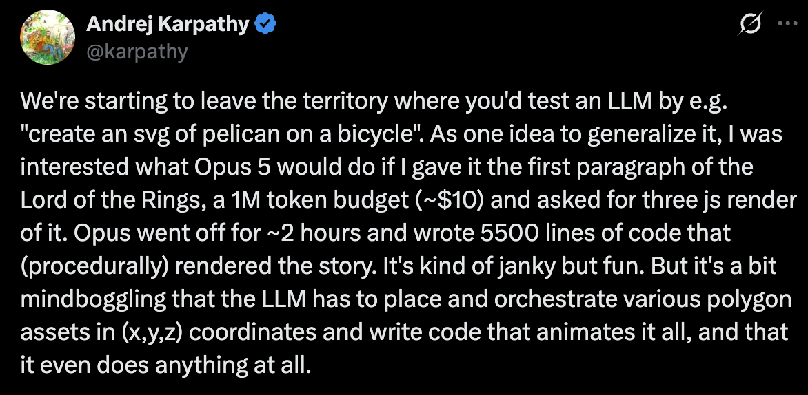

# The Odyssey — "Tell me, O Muse…"

## The original prompt

> Look at how this was run and create something similar. Go off and return a
> movie on the first lines of the odyssey:
>
> TELL ME, O MUSE, of that ingenious hero who traveled far and wide after he
> had sacked the famous town of Troy. Many cities did he visit, and many were
> the nations with whose manners and customs he was acquainted; moreover he
> suffered much by sea while trying to save his own life and bring his men
> safely home…
>
> **The inspiration:**
>
> "We're starting to leave the territory where you'd test an LLM by e.g.
> 'create an svg of pelican on a bicycle'. As one idea to generalize it, I
> was interested what Opus 5 would do if I gave it the first paragraph of the
> Lord of the Rings, a 1M token budget (~$10) and asked for three js render
> of it. Opus went off for ~2 hours and wrote 5500 lines of code that
> (procedurally) rendered the story. It's kind of janky but fun…" —
> https://x.com/karpathy/status/2083749667410727319 · movie's site:
> https://karpathy.ai/lotr-movie/
>
> 

The movie cost **~$0.08** to build (about 360K fresh tokens — vs Opus's
1M-token / ~$10 budget). Everything since the first render was just me
editing.

## About the film

A procedural film of the opening of Homer's *Odyssey* (Book I, Samuel Butler
translation), generated entirely in code. Every mesh, texture, camera move,
particle and sound is synthesized at runtime with [three.js](https://threejs.org)
and WebAudio — there are no models, no images and no video. Nine sequences,
24 shots, ~118 seconds, cut to a narration track. Scene generation runs off a
seeded PRNG, so the film renders identically every play. No build step, no
dependencies beyond three.js from a CDN; the repo root *is* the deployable
site, and any static host will serve it.

## Watch it

Serve the repo root over HTTP (ES modules and audio won't load from `file://`):

    python3 -m http.server 8123
    # then open http://localhost:8123/

`server.py` does the same thing with caching disabled, which is handy while
editing: `python3 server.py 8123`.

Press **Play**. Everything else is keyboard:

| Key | |
| --- | --- |
| `space` | play / pause |
| `[` `]` | previous / next shot |
| `←` `→` | ±5s (hold `shift` for ±15s) |
| `c` | captions |
| `v` | narration |
| `m` | ambient sound |
| `f` | fullscreen |
| `Home` | restart |

Deep-link straight into a frame — useful for inspecting a single shot without
sitting through the film:

    /?auto&shot=14&t=2.2      # jump to shot 14, 2.2s in, paused
    /?auto&shot=19&play       # play from shot 19

## How it works

**The director owns the clock.** `src/engine/director.js` builds every shot up
front (so playback never hitches), then runs one `requestAnimationFrame` loop
that advances a single global time, picks the active shot, calls its `update`,
renders it, and drives the fades and captions. Only the active shot is
rendered, so scene cost is per-shot rather than cumulative.

**A sequence is one world, cut several times.** Building a world is the
expensive part, so a shot is deliberately *not* a scene. `sequence()` in
`src/shots/common.js` builds a world once and hands it to a run of shots that
each bring only a camera; cutting between angles then costs nothing, which is
what lets the film hold a ~4-second average shot length. A shot spec is
`{ duration, title, caption, make(S, dur) → { camera, update } }`, and the
sequence's `ambient(seqT, dt)` keeps waves, fire and weather running *across*
the cuts instead of snapping back.

**The film is cut to the narration.** `src/timing.js` holds the measured
length of every narration clip. `sequence()` stretches each shot to
`max(authoredDuration, clipLength + 0.45)` — the beat of silence after a line —
and then time-warps the sequence to fill it, so choreography keeps its shape
and simply plays at the narration's pace. Change a clip and the film re-cuts
itself.

**Everything is deterministic.** `src/engine/rng.js` is a seeded mulberry32
plus value noise; scene code never touches `Math.random()`. Same seeds, same
polygons, same film.

**The sound is synthesized too.** `src/engine/audio.js` builds one looping
filtered-noise voice per element (wind, waves, rain, fire, birds, drip, pad).
Each sequence picks a mix and the gains ease toward it; thunder is scheduled
against the director's clock so it lands on the lightning.

**The title screen is a watch dial.** An inline SVG field watch whose seconds
hand and progress ring sweep with loading, and then with the film's own
progress.

## The narration

The 23 narration clips in `audio/` are pre-rendered TTS, one per captioned
shot: shot index *i* maps to `audio/narr_XX.mp3` with `XX` zero-padded. They
are the only shipped media in the project.

Each line is rendered against a byte-identical instructions block with a
pinned model snapshot, so re-voicing one sentence does not shift the delivery
of the others. The final voice is OpenAI onyx with the crescendo delivery
template.

To re-voice: render the clips, run the silence pass, then update the measured
lengths.

    python scripts/gap-report.py            # report lead/tail silence per clip
    python scripts/gap-report.py --trim     # back up, then trim it off

`scripts/gap-report.py` is a standalone tool (numpy + soundfile, plus
imageio-ffmpeg for `--trim`): unspoken silence at the head or tail of a clip
becomes a hole in a narration-cut film, so it is measured and removed rather
than tolerated. Then re-measure the trimmed clips and update `src/timing.js`.

## Inspiration

Andrej Karpathy's [lotr-movie](https://karpathy.ai/lotr-movie/) — the idea
that a model with a large budget and infinite patience will happily place
polygons in (x, y, z) for hours, doing work no human would ever sit down to
do. Same idea, different poem.

## Credits

- Homer, *The Odyssey*, Book I, translated by Samuel Butler — public domain.
- [three.js](https://threejs.org) (MIT), loaded from the unpkg CDN.

## License

MIT — see [LICENSE](LICENSE). The license covers the code; the Butler
translation is public domain.
